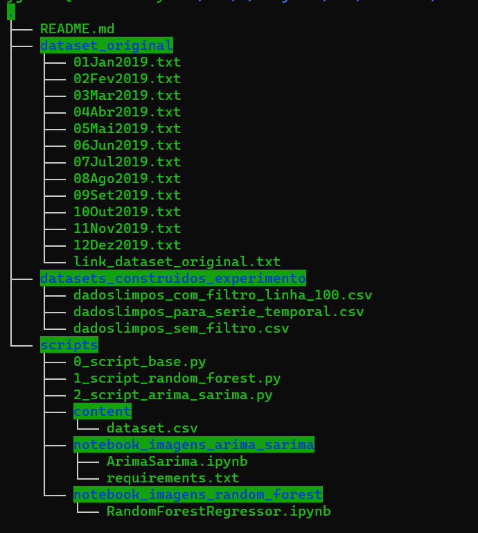

# Documentação trabalho de aprendizado de máquina 2023.1

## A árvore do projeto segue como a imagem a seguir:

## Onde localizar o dataset original?
R: O dataset original encontra-se na pasta `dataset_original/`, onde estão presentes os arquivos .txt

## Onde localizar o link do dataset original?
R: É possível localizar o link do dataset original no arquivo `link_dataset_original.txt`.

## Onde localizar os datasets construídos para os experimentos?
R: Os datasets construídos para os experimentos localizam-se na pasta `datasets_construidos_experimento/`.

## Onde localizar os scripts do trabalho?
R: Os scripts podem ser localizados na pasta `scripts/`.

## Qual é o passo a passo de se executar a jornada SARIMA & ARIMA?

1. Com o jupyter notebook aberto, crie uma pasta no ambiente do notebook chamada `dataset/`, em seguida, faça upload dos arquivos txt presentes em `dataset_original`.

2. Faça upload do arquivo `requirements.txt` presente em `scripts/notebook_imagens_arima_sarima/requirements.txt` para a raíz do projeto do notebook.

3. Faça upload do arquivo do arquivo `.ipynb` localizado em `scripts/notebook_imagens_arima_sarima/ArimaSarima.ipynb` para a raíz do projeto do notebook.

4. Execute o notebook pelo botão de `Restart the kernel and run all cells.`

## Qual é o passo a passo de se executar a jornada de RandomForest?

1. Crie um notebook no Google Colab.

2. Crie um pasta chamada `dataset/`.

3. Faça upload dos arquivos txt presentes em `dataset_original`.

4. Faça upload do arquivo `.ipynb` localizado em `scripts/notebook_imagens_random_forest/RandomForestRegressor.ipynb` para o Google Colab.

5. Execute todas as células do notebook.

> É mais recomendável executar os notebooks comparados aos scripts.